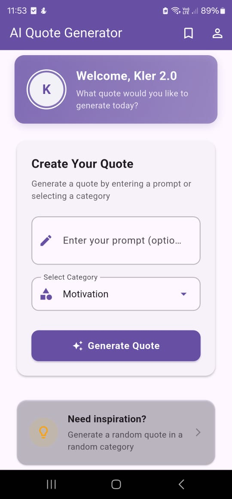

# InspireCloud - AI Quote Generator & Collection

A Flutter-based mobile application that leverages AI to generate inspirational quotes and allows users to save and manage their favorite quotes.



## Features

- 🔐 **Secure Authentication**: Email/password authentication with Firebase
- 🤖 **AI-Powered Quotes**: Generate inspirational quotes using OpenAI's GPT-3.5 model
- 📚 **Quote Collection**: Save, search, and manage your favorite quotes
- 👤 **User Profiles**: Customize your profile with display name and photo
- 📱 **Clean UI**: Modern, intuitive interface with smooth animations
- 📤 **Sharing**: Share your favorite quotes with others

## Technologies Used

- **Frontend**: Flutter & Dart
- **Authentication**: Firebase Authentication
- **Database**: Cloud Firestore (NoSQL)
- **Storage**: Firebase Storage
- **AI**: OpenAI GPT-3.5 Turbo API
- **State Management**: Provider Pattern

## Getting Started

### Prerequisites

- Flutter SDK (latest stable version)
- Android Studio or VS Code with Flutter extensions
- Firebase account
- OpenAI API key

### Installation

1. Clone the repository:
   ```bash
   git clone https://github.com/your-username/inspirecloud.git
   cd inspirecloud
   ```

2. Create a `.env` file in the root directory with your OpenAI API key:
   ```
   OPENAI_API_KEY=your_openai_api_key_here
   ```

3. Set up Firebase:
   - Create a new Firebase project
   - Enable Authentication (Email/Password)
   - Set up Firestore Database
   - Set up Firebase Storage
   - Download `google-services.json` and place it in the `android/app` directory

4. Install dependencies:
   ```bash
   flutter pub get
   ```

5. Run the application:
   ```bash
   flutter run
   ```

## Project Structure

```
lib/
├── controllers/       # Business logic
├── models/            # Data models
├── services/          # External service integrations
├── views/             # UI screens and components
└── main.dart          # Application entry point
```

## Authentication Flow

The application uses Firebase Authentication for user management:

1. User registers with email/password
2. Email verification (optional)
3. Secure login with credential validation
4. Password reset functionality
5. Profile management with Firestore integration

## Quote Generation

Quotes are generated using OpenAI's GPT-3.5 Turbo model:

1. User selects a category (e.g., Motivation, Success, Life)
2. Optionally enters a custom prompt
3. Request is sent to OpenAI with appropriate context
4. Generated quote is displayed with options to save or regenerate

## Database Structure

The application uses Firestore with the following collections:

- **users**: User profile information
- **saved_quotes**: Quotes saved by users
- **user_stats**: Usage statistics tracking

## Contributing

Contributions are welcome! Please feel free to submit a Pull Request.

1. Fork the repository
2. Create your feature branch (`git checkout -b feature/amazing-feature`)
3. Commit your changes (`git commit -m 'Add some amazing feature'`)
4. Push to the branch (`git push origin feature/amazing-feature`)
5. Open a Pull Request

## License

This project is licensed under the MIT License - see the [LICENSE](LICENSE) file for details.

## Acknowledgments

- [Flutter](https://flutter.dev/) for the amazing UI toolkit
- [Firebase](https://firebase.google.com/) for Backend-as-a-Service
- [OpenAI](https://openai.com/) for the powerful language model
- All contributors and testers

---

Developed for COMP3207 Cloud Application Development
